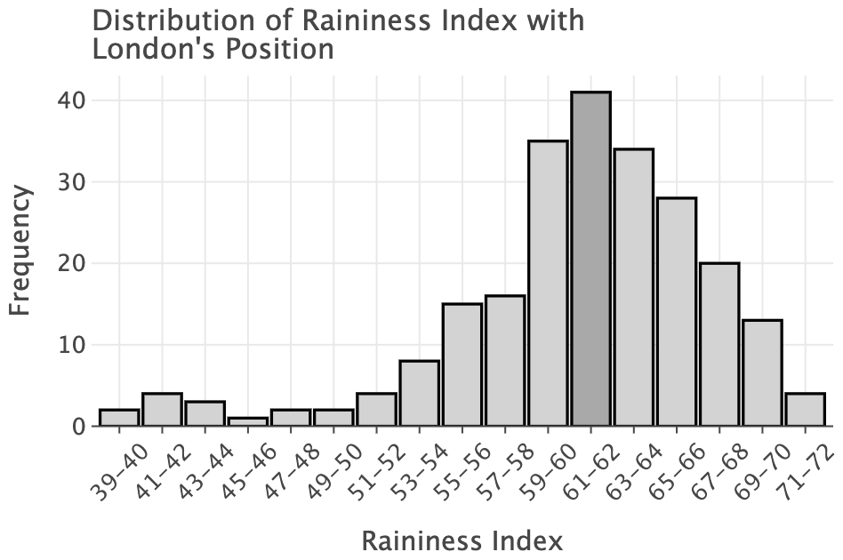
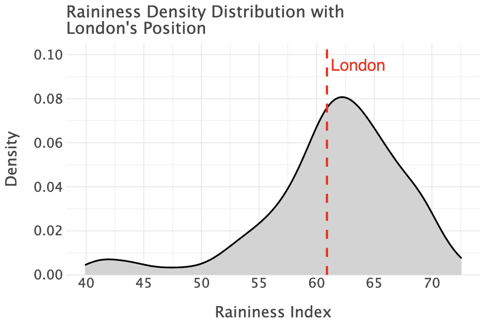
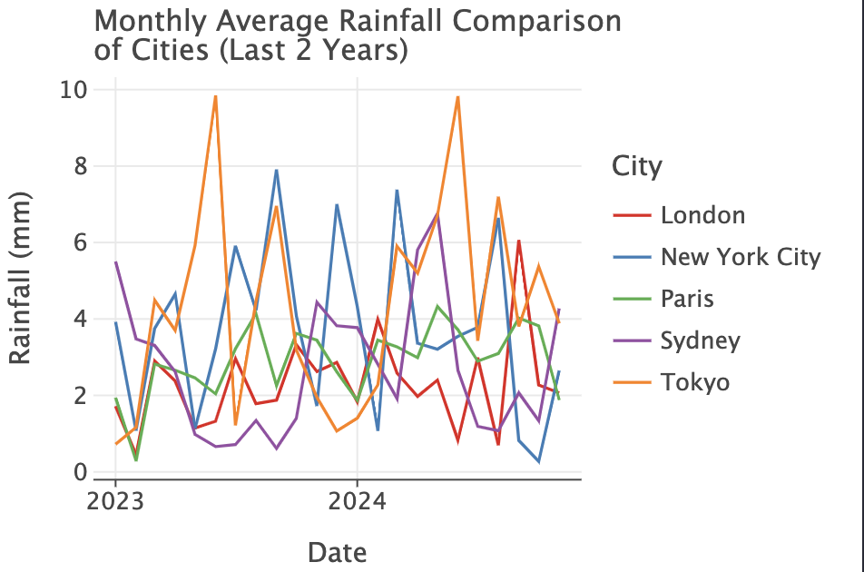

# <center>Is London Really as Rainy as the Movies Make It Out To Be? An Exploratory Data Analysis</center> 
This project investigates London's reputation as a perpetually rainy city and explores whether its weather patterns align with this perception.

***

## Table of Contents
- [Project Overview](#project-overview)
- [How to Run the Code](#how-to-run-the-code)
- [Data Collection](#data-collection)
- [Libraries and Dependencies](#libraries-and-dependencies)
- [Results](#results)
- [References and Sources](#references-and-sources)

---

## Project Overview

London has long been portrayed as a city with persistent rain. In this project, I explore the accuracy of this portrayal by analyzing historical weather data. By using the OpenMeteo API, I assess the average rainfall for cities worldwide, focusing on London, and compare it against other major cities to determine whether the "rainy" stereotype holds up.

The project uses a combination of data collection, cleaning, and visualization techniques to offer an insightful exploration of the weather patterns across cities globally.

---

## How to Run the Code

The code is organized across three Python files for easier management and testing:

- [Data Collection](code/Data_Collection.py)
- [Functions](code/Functions.py)
- [Data Processing](code/Data_Processing.ipynb) (Jupyter Notebook)

The Jupyter Notebook contains the primary analysis, including visualizations, based on the collected data. The `.py` files contain functions and testing for data processing and collection.

### Installation Instructions

Before running the project, you need to install the required libraries. Open the terminal and install the libraries as follows:

```bash
pip install pandas lets-plot geopandas
```

---

## Data Collection
To collect the necessary data, run the **Data_Collection.py** script. The script fetches data from OpenMeteo's API and saves it in a CSV file, which is then used for analysis. In the terminal, type the following command:

```
>>> python Data_Collection.py
```

**Note:** The OpenMeteo API has request rate limits, so this script will take approximately **20.8** minutes to complete. You can download the pre-collected data file directly from this repository: [rainiest_cities.csv.](data/rainiest_cities.csv)

Once the data is collected, run the Jupyter Notebook, [Data_Processing.ipynb](code/Data_Processing.ipynb), using the "Run All" button in the notebook to visualize and analyze the data.

---

## Libraries and Dependencies
The project uses the following Python libraries:

- **pandas:** For data manipulation and analysis.
- **lets-plot:** For creating interactive visualizations.
- **geopandas:** For geographic data handling and plotting.

These libraries can be installed via `pip` as shown in the **Installation Instructions.**

---

## Results

### 1. Distribution of Raininess Index with London's Position


- **Insight**:  
   - The histogram shows that the **raininess index** is normally distributed, with most cities falling in the 59–64 range.  
   - London’s position at **60** aligns with the most frequent range, reinforcing its average raininess relative to other cities.  
   - Fewer cities exhibit extremely low (below 50) or high (above 70) raininess values.

---

### 2. Raininess Density Distribution with London's Position


- **Insight**:  
   - The **raininess index** has a distribution centered around 60, indicating a typical raininess value for the dataset.  
   - London's position is highlighted with a **raininess index of ~60**, which aligns closely with the peak density, suggesting London's raininess is typical compared to other cities in the dataset.

---

### 3. Monthly Average Rainfall Comparison of Cities (Last 2 Years)


- **Insight**:  
   - **Tokyo** experiences the highest variability in rainfall, with several peaks exceeding 10 mm across months.  
   - **New York City** and **Sydney** show similar periodic spikes, while **London** and **Paris** remain relatively stable with lower rainfall averages.  
   - This suggests significant seasonal trends in cities like Tokyo and New York compared to the consistent rainfall observed in European cities.

---

### Summary of Findings
The analysis provides the following insights:
1. **Rainfall Variability**: Tokyo and New York City show significant variability in rainfall over the past 2 years, while cities like London and Paris maintain lower, consistent averages.
2. **Raininess Index**: London has an average raininess index (~60), aligning with the peak of both the density distribution and histogram.
3. **Normal Distribution**: The raininess index is approximately normally distributed, with most cities falling within a narrow range (59–64), suggesting consistent rainfall patterns globally.


---

## References and Sources

- **OpenMeteo API:** Used for fetching weather data to analyze precipitation levels across cities.
- **Wikipedia:** The ["List of countries by average annual precipitation"](https://en.wikipedia.org/wiki/List_of_countries_by_average_annual_precipitation) was used to verify that the results in the analysis reflect common precipitation metrics.

***

**Author:** Mia Jaenike<br>
**Contact:** miaajaenike@gmail.com<br>
**Last Updated:** 2024-12-11
